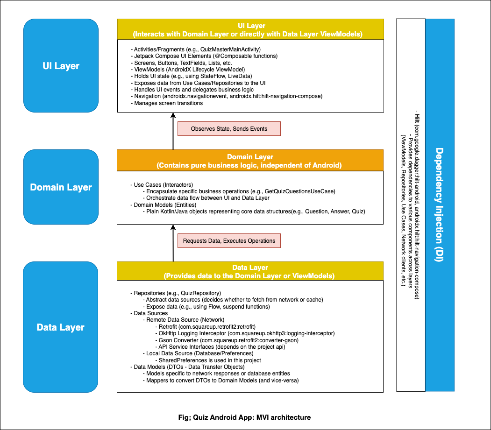

# QuizMaster Android App

QuizMaster is an engaging Android application built to test your knowledge across various topics. It's developed using modern Android development practices, emphasizing a clean and scalable architecture.

## Architecture

This project follows the principles of **Clean Architecture** to ensure a separation of concerns, making the codebase maintainable, testable, and scalable. The main layers are:

*   **UI (Presentation) Layer:**
    *   Built entirely with **Jetpack Compose** for a modern, declarative UI.
    *   Utilizes **AndroidX ViewModels** to manage UI-related data and state in a lifecycle-conscious manner.
    *   Handles navigation using **Jetpack Navigation for Compose** (`androidx.navigationevent`, `androidx.hilt:hilt-navigation-compose`).
    *   Responds to user interactions and updates the UI accordingly.

*   **Domain Layer (Conceptual):**
    *   (Planned/Partially Implemented) This layer will contain the core business logic of the application, independent of any Android framework specifics.
    *   **Use Cases (Interactors):** Encapsulate specific application operations (e.g., fetching quiz questions, submitting answers).
    *   **Domain Models (Entities):** Plain Kotlin data classes representing the core concepts of the quiz (e.g., `Question`, `Answer`, `Quiz`).

*   **Data Layer:**
    *   **Repositories:** Act as the single source of truth for app data. They abstract the data sources (network, local cache) from the rest of the app.
    *   **Remote Data Source:**
        *   Uses **Retrofit** for making network requests to the quiz API.
        *   **Gson** is used for JSON parsing.
        *   **OkHttp Logging Interceptor** for debugging network calls.
    *   **(Planned) Local Data Source:** Future integration for caching quiz data or user preferences using Room or DataStore.
    *   **Data Models (DTOs):** Data Transfer Objects used for network responses, mapped to Domain Models.

*   **Dependency Injection:**
    *   **Hilt** is used for managing dependencies throughout the application, promoting loose coupling and making components easier to test and manage.
---

## Diagrammatic Representation:

---

## Core Technologies & Libraries

*   **Kotlin:** Primary programming language.
*   **Jetpack Compose:** For building the UI.
*   **Kotlin Coroutines & Flow:** For asynchronous programming.
*   **AndroidX Libraries:**
    *   ViewModel
    *   Lifecycle
    *   Navigation
*   **Hilt:** For dependency injection.
*   **Retrofit:** For type-safe HTTP requests.
*   **Gson:** For JSON serialization/deserialization.
*   **OkHttp Logging Interceptor:** For network call logging.
---

## Future Roadmap

### Phase 2: User Authentication
- Firebase Auth / OAuth support
- Sync user progress with cloud
- Global and category-based leaderboards
- Share results and compete with friends
- Adaptive quizzes based on history
- ML-based question recommendations

---

## Setup Instructions
1. **Clone the repo:**
   ```bash
   git clone https://github.com/mrkivan/quiz_app_android.git
   cd quiz_app_android
   ```
2. Open in Android Studio (Giraffe or later)
3. Run the app on emulator/device

## Dependencies

- Jetpack Compose (UI)
- Hilt (DI)
- Navigation Compose (Navigation)
- okhttp, retrofit, gson and others